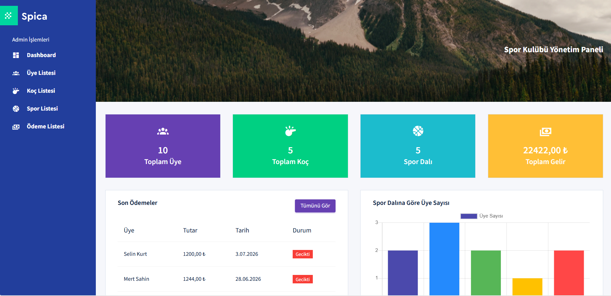
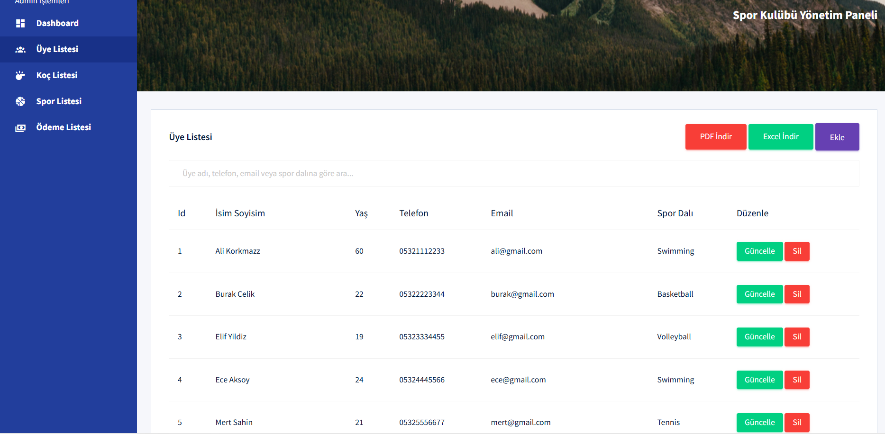
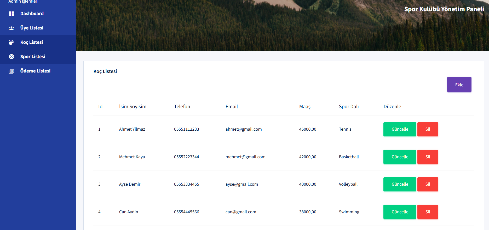
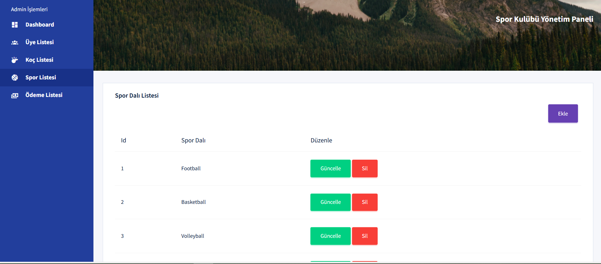
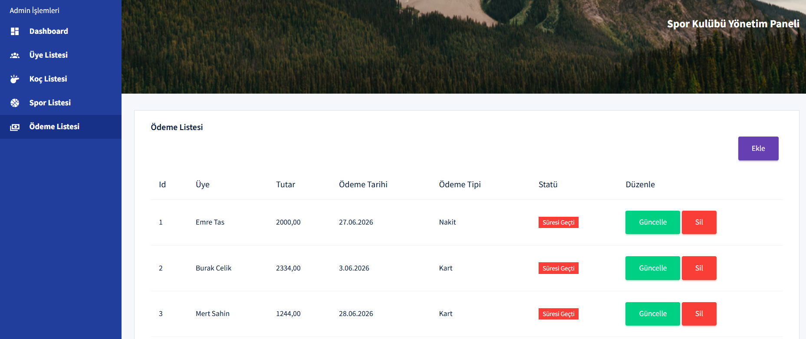
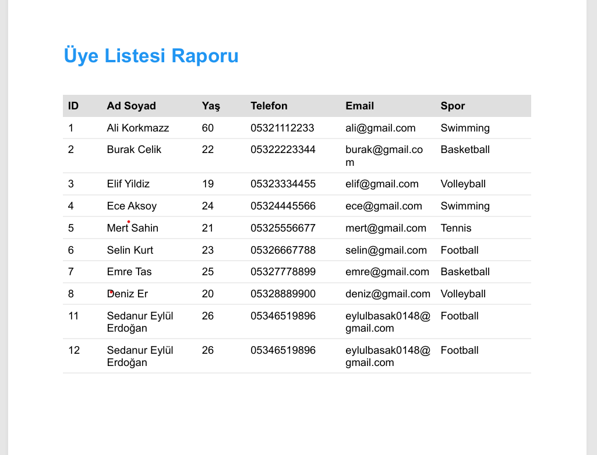
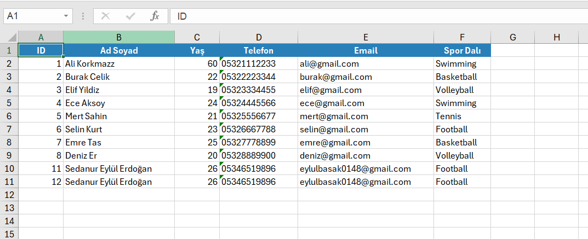

<!-- HEADER -->

<div align="center">

# 🏋️ Sport Club Management System

### Modern Sport Club Management System with ASP.NET Core MVC, Entity Framework Core & Layered Architecture

A modern sport club management application developed using ASP.NET Core MVC, Entity Framework Core Code First, SQL Server and Layered Architecture. The project includes member management, coach management, sports management, payment tracking, reporting dashboard, PDF & Excel export features.


---


</div>

---

# 📸 Project Screenshots

## Dashboard



---

## Member Management



---

## Coach Management



---

## Sport Management



---

## Payment Management



---

## PDF Report



---

## Excel Report



---

# 🚀 Project Features

### 🏋️ Club Management

- Dashboard
- Member Management
- Coach Management
- Sport Branch Management
- Payment Management
- Search Members
- Responsive Admin Panel

---

### 📊 Reporting Dashboard

- Total Member Count
- Total Coach Count
- Total Sport Branch Count
- Total Payment Amount
- Recent Payments
- Member Distribution by Sport Branch (Chart.js)
- Coach Report
- Payment Status Tracking

---

### 📄 Export Features

- Member List PDF Export
- Member List Excel Export

---

# 🏗 Project Architecture

```text
SportClub

│

├── SporKulubu.Model

├── SporKulubu.Data

└── SporKulubuCodeFirstKatmanliMimariProjectUI

    ├── ASP.NET Core MVC

    ├── Entity Framework Core

    ├── SQL Server

    ├── Repository Pattern

    ├── Generic Repository

    ├── Layered Architecture

    ├── LINQ

    ├── Bootstrap Admin Panel

    ├── Chart.js

    ├── QuestPDF

    └── EPPlus
```

---

# 🛠 Technologies

| Backend | Frontend | Database | Other |
|----------|----------|----------|--------|
| ASP.NET Core MVC | Bootstrap 5 | SQL Server | Entity Framework Core |
| C# | HTML5 | Code First | LINQ |
| Razor | CSS3 | Migration | Chart.js |
| Repository Pattern | JavaScript | | QuestPDF |
| Generic Repository | Responsive Design | | EPPlus |
| Layered Architecture | | | |

---

# 📊 Modules

✔ Dashboard

✔ Member Management

✔ Coach Management

✔ Sport Management

✔ Payment Management

✔ Member Search

✔ Reporting Dashboard

✔ Member Statistics

✔ Payment Statistics

✔ Chart.js Reports

✔ PDF Report Export

✔ Excel Report Export

✔ Responsive Admin Panel

---

# 📂 Database Tables

| Table |
|---------|
| Members |
| Coaches |
| Sports |
| Payments |

---

# 📈 Dashboard Reports

- 👥 Total Members
- 🏋️ Total Coaches
- 🏀 Total Sport Branches
- 💰 Total Payment Amount
- 📅 Recent Payments
- 📊 Members by Sport Branch Chart
- 👨‍🏫 Coach Report
- ✅ Payment Status

---

# 🎯 Learning Outcomes

- ASP.NET Core MVC
- Entity Framework Core
- Code First Approach
- Layered Architecture
- Repository Pattern
- Generic Repository
- SQL Server
- LINQ Queries
- CRUD Operations
- Bootstrap Dashboard Design
- Chart.js Integration
- PDF Report Generation
- Excel Report Generation
- Responsive Web Design

---

# ⭐ Project Status

✅ Completed

---

<div align="center">

Made with ❤️ using ASP.NET Core MVC & Entity Framework Core

</div>
